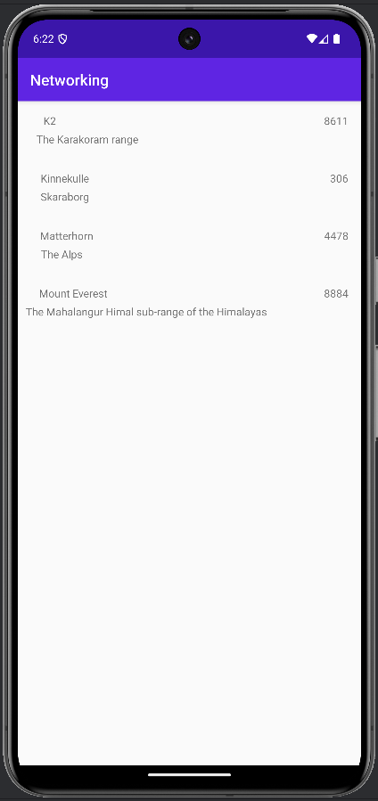

# Rapport Oskar Steise

- La till RecyclerView och gav den constraints och ID.
- La till layout-fil (recycler_view_row.xml) till recyclerview för att kunna lägga till rader och vad dessa ska innehålla. 
- Skapade en adapter till recycler view för att koppla ihop textviews i raderna med arraylistan 
```
    Context context;
    ArrayList<Mountain> mountainList;

    public RecyclerViewAdapter(Context context, ArrayList<Mountain> mountainList) {
        this.context = context;
        this.mountainList = mountainList;
    }

    public static class MyViewHolder extends RecyclerView.ViewHolder {

        TextView textView;
        TextView locationView;
        TextView heightView;


        public MyViewHolder(@NonNull View itemView) {
            super(itemView);

            textView = itemView.findViewById(R.id.textView);
            locationView = itemView.findViewById(R.id.locationView);
            heightView = itemView.findViewById(R.id.heightView);

        }
    }
```

- La till arraylist med egna (test)strängar för att kontrollera så att recycler view funkade och så att textviews i raden fick värdena i arrayen. (Denna array har blivit borttagen)
- Skapade arrayList Mountain, och dess class. Gjorde sedan klart variabler som kräves. Skapade sedan getters och konverterade heltal till strängar. Därför har heltalet i kodexemplet nedanför fått ""+ framför sig, för att göra om den till en sträng. 
```
    public String getHeight() {
        return ""+height;
    }
```
- Färdigställde onPostExecute, så att den tar emot JSON datan och gör om denna till strängar och lagrar i arraylistan för mountains med hjälp av en for loop, som knyter dess värden till korrekt variabel.
- Sedan så knyts dessa till adaptern för recycleview.
```
            JSONArray jsonArr = new JSONArray(json);
            RecyclerView recyclerView =findViewById(R.id.myRecyclerView);


            ArrayList<Mountain> mountainList = new ArrayList<>();

            Log.d("MainActivity", json);
            for (int i = 0; i < jsonArr.length(); i++) {
                JSONObject jsonObj = jsonArr.getJSONObject(i);

                String name = jsonObj.getString("name");
                String location = jsonObj.getString("location");
                int height = jsonObj.getInt("size");

                mountainList.add(new Mountain(name, location, height));

            }

            RecyclerViewAdapter adapter = new RecyclerViewAdapter(this, mountainList);
            recyclerView.setAdapter(adapter);
            recyclerView.setLayoutManager(new LinearLayoutManager(this));
```
- La till adapter.notifyDataSetChanged(); i slutet av onPostExecute funktionen.
- Snyggade till layout till recycler_view_row.




